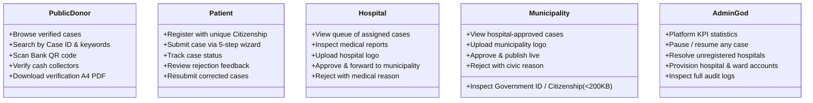
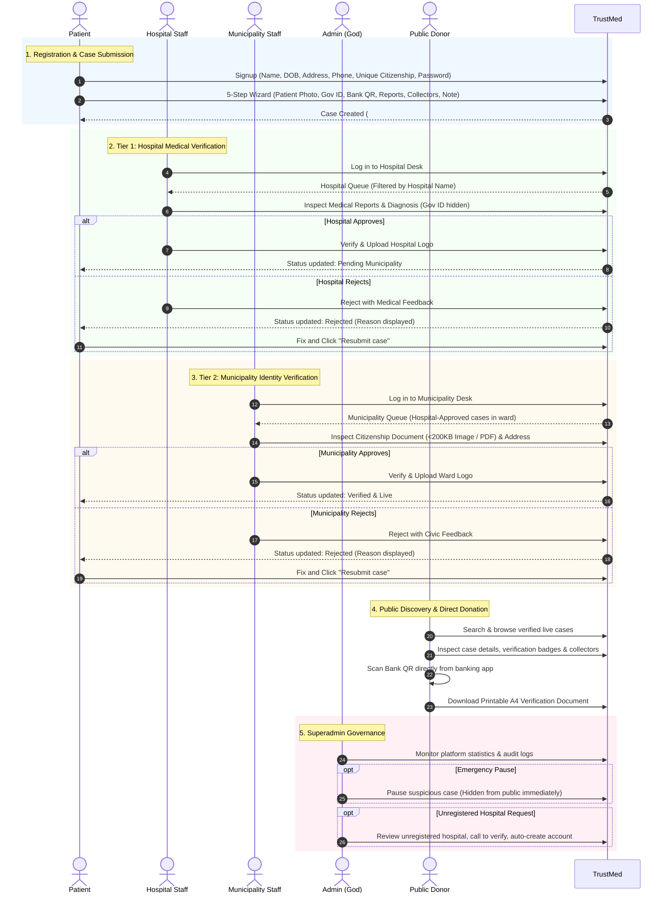
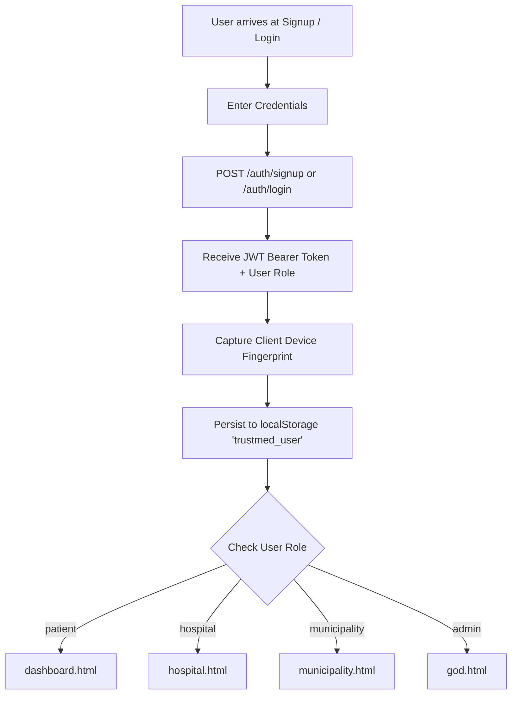
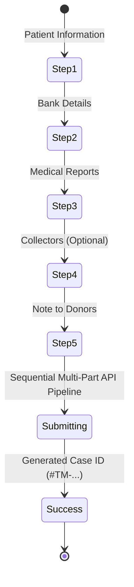
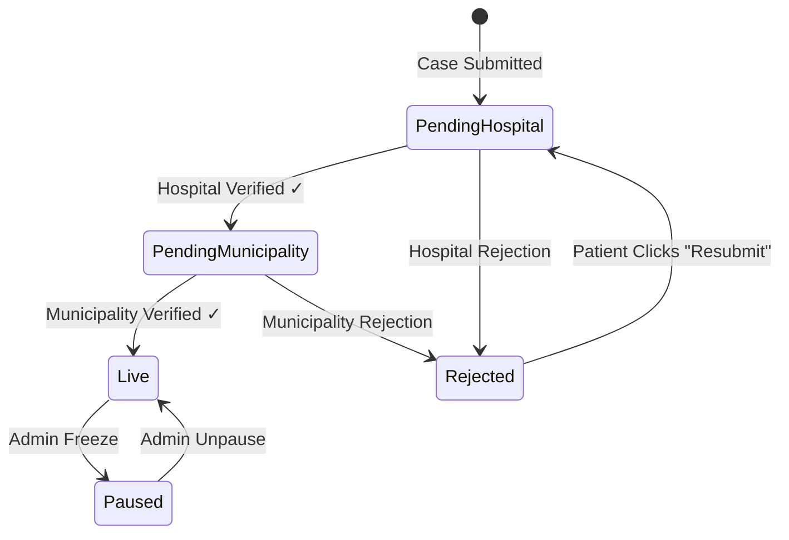
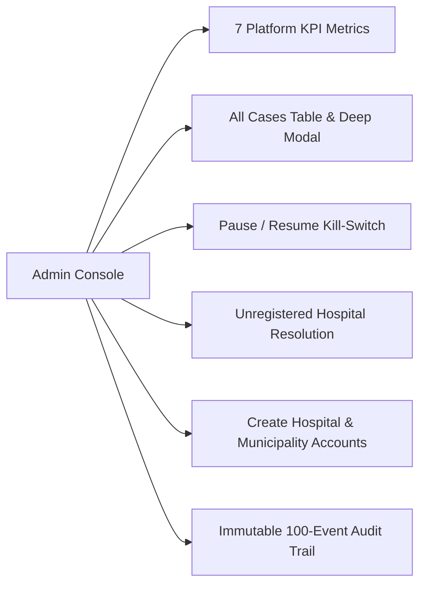

# TrustMed System Architecture & Workflow Documentation

**Verified Medical Crowdfunding Platform**  
*Document Version: 2.0.0 | Last Updated: 2026*

---

## 1. Executive Summary & Core Value Proposition

Medical crowdfunding is plagued by fraud, duplicate campaigns, fabricated medical bills, and unauthorized cash collections. Donors lack confidence that their contributions reach genuine victims, while legitimate patients struggle to prove their medical authenticity.

**TrustMed** solves this crisis through a **two-tier verification architecture**:
1. **Tier 1 (Medical Verification)**: The treating hospital confirms the patient's diagnosis and validates medical reports.
2. **Tier 2 (Identity & Civic Clearance)**: The local municipal ward office verifies the patient's identity and residence against authentic government citizenship records.

Only after **both tiers approve** does a fundraiser go live publicly.

```
       [ Patient Submits Case ]
                  │
                  ▼
       ┌─────────────────────┐
       │   Hospital Desk     │  ──(Checks medical reports & diagnosis)──► [Reject to Patient]
       └──────────┬──────────┘                                                 ▲
                  │ Approved                                                   │
                  ▼                                                            │
       ┌─────────────────────┐                                                 │
       │  Municipality Desk  │  ──(Checks Government ID / Citizenship)─────────┘
       └──────────┬──────────┘
                  │ Approved
                  ▼
       ┌─────────────────────┐
       │   Public Platform   │  ◄── Verified & Live (Hospital + Ward Badges)
       └─────────────────────┘
```

In addition, TrustMed provides:
- **Privacy-Preserving Direct Giving**: Donors scan the patient's hospital/personal **Bank QR code** directly; the patient's bank account number is masked from the public.
- **Authorized Cash Collectors**: To eliminate street charity scams, physical collectors must be registered with photo, contact, and relationship to the victim, creating an indisputable authorization trail.
- **Printable A4 Verification PDF**: A dual-QR printable document (QR 1 for online verification, QR 2 for direct bank donation) providing physical proof in hospitals and public spaces.

---

## 2. System Architecture & Role Permissions Model

The platform operates across 5 discrete user roles, each with strict access boundaries:



### Role Breakdown

| Role | Access Scope | Authentication | Core Responsibility |
|---|---|---|---|
| **Public / Donor** | Public catalog (`/victims/`) | Anonymous | Browse verified cases, donate via Bank QR, verify collectors, download PDF |
| **Patient** | Personal cases (`/victims/all` filtered by `account_id`) | JWT Bearer Token | Submit cases, upload reports, provide Bank QR & Gov ID, resubmit if rejected |
| **Hospital** | Cases treating at their hospital (`hospital_name`) | JWT Bearer Token | Validate diagnosis, review lab reports, upload official logo, forward to ward |
| **Municipality** | Cases within their ward (`municipality_name`) | JWT Bearer Token | Verify citizenship & address, review Gov ID, upload ward logo, publish live |
| **Superadmin (God)** | System-wide (`/admin/*`) | JWT Bearer Token | Platform safety, emergency pause, unregistered hospital verification, audit log |

---

## 3. End-to-End System Workflow Map



---

## 4. Deep-Dive Workflow Specifications

### Workflow 1: Public Discovery, Verification Inspection & Donation

* **Target Page**: `frontend/src/pages/index.html`, `frontend/src/pages/cases.html`, `frontend/src/pages/case.html`
* **Controller**: `frontend/src/js/cases.js`, `frontend/src/js/case.js`
* **Access**: Public / Unauthenticated

#### 1.1 Home & Discovery (`index.html`)
* **Hero Banner**: Communicates TrustMed's dual-verification model with direct calls-to-action ("Start a Fundraiser", "Browse Cases").
* **Trust Indicators**: Highlights 3 pillars:
  1. *Diagnosis confirmed by hospital*
  2. *Identity verified by municipality*
  3. *Funds go to verified bank account*
* **Search Engine**: Input field allowing lookup by Case ID (e.g. `TM-2026-0042`) or free-text keywords. Pressing Enter or clicking Search redirects to `cases.html?search=<query>`.
* **Featured Grid**: Shows up to 6 verified live cases with interactive cards.

#### 1.2 Public Catalog & Search Filtering (`cases.html` / `cases.js`)
* Calls `victimsAPI.getAll()` (`GET /victims/`).
* Automatically filters for:
  ```javascript
  v.hospital_verified === true && v.muni_verified === true && v.paused === false && v.rejected === false
  ```
* Client-side search filters across:
  - `case_id`
  - Patient `name`
  - `disease` (diagnosis)
  - `municipality_name`
  - `hospital_name`
* Each card renders:
  - Patient portrait (or initials fallback avatar)
  - Full name & ward/municipality
  - Truncated diagnosis text (2 lines max)
  - Visual funding progress bar (`Math.min(100, (total_collected / estimated_cost) * 100)`)
  - Raised vs Goal amount formatted in Nepali Rupees (`₨`)
  - Two verification badges: `Hospital verified` (Green) and `Municipality approved` (Blue)

#### 1.3 Case Detail & Direct Giving (`case.html` / `case.js`)
* Reads `?id=<victim_id>` query param. Calls `victimsAPI.get(id)`.
* **Institutional Verification Badges**:
  - Displays official Hospital Logo and Municipality Logo side by side in a dedicated trust container.
  - Shows green/blue checkmark status pills.
* **Direct Bank Donation Panel**:
  - Renders patient's uploaded **Bank QR Code** (`/uploads/<bank_qr>`).
  - Displays Bank Name, Account Holder Name, and Branch.
  - **Privacy Rule**: The raw bank account number is masked (`****`) to prevent unauthorized scraping or fraud. Donors donate directly by scanning the QR code using their mobile banking app (e.g., Fonepay, connectIPS, eSewa, Khalti, Mobile Banking).
* **Authorized In-Person Cash Collectors**:
  - Renders all authorized collectors registered for the case.
  - Displays collector face photo, full name, address, relationship to patient, and contact phone number.
  - **Anti-Fraud Guard**: Donors giving cash in person can demand that collectors match this verified profile page.
* **Medical Reports Viewer**:
  - Direct links to view lab reports, discharge summaries, and doctor prescriptions (`/uploads/<filename>`).
  - Images are enhanced on the backend for sharpness and contrast to preserve diagnostic legibility.
* **Printable A4 Verification PDF**:
  - Includes a prominent "Download verification PDF" button linking to `/victims/{id}/pdf`.

---

### Workflow 2: Patient Registration, Authentication & Device Fingerprinting

* **Target Page**: `frontend/src/pages/signup.html`, `frontend/src/pages/login.html`
* **Controller**: `frontend/src/js/signup.js`, `frontend/src/js/login.js`, `frontend/src/api.js`



#### 2.1 Citizen Registration (`signup.html`)
* Captures: Full Name, Date of Birth, Contact Phone, Residential Address, Citizenship Number, Username, and Password.
* **Citizenship Unique Constraint**: The `citizenship` number acts as the physical primary key. If a user attempts to register with a duplicate citizenship number, the backend rejects it with HTTP 400 (`"Citizenship number already registered"`).
* Password hashed using `bcrypt` on the server.
* On success, returns JWT access token and user object.

#### 2.2 Device Fingerprinting & State Management (`api.js`)
* Generates a persistent UUID stored in `localStorage` under `trustmed_device`.
* Captures device metadata:
  ```javascript
  {
    ua: navigator.userAgent,
    platform: navigator.platform,
    tz: Intl.DateTimeFormat().resolvedOptions().timeZone,
    screen: `${screen.width}x${screen.height}`
  }
  ```
* Stores session in `localStorage` under `trustmed_user`:
  ```javascript
  {
    id: 12,
    username: "ram_shrestha",
    role: "patient",
    token: "eyJhbGciOi...",
    deviceId: "c4a7...",
    deviceInfo: { ... },
    loginAt: 1774415800000
  }
  ```
* Seamless auto-cleanup: If an API call receives HTTP 401, `clearUser()` is triggered and the user is redirected to `login.html`.

#### 2.3 Dynamic Topbar (`topbar.js`)
* Automatically injects contextual navigation and role pills into `.topbar`:
  - Patient role -> Pill `Patient` (Blue), links to `My cases`, button `Start a fundraiser`.
  - Hospital role -> Pill `Hospital` (Green), links to `Desk`.
  - Municipality role -> Pill `Municipality` (Amber), links to `Desk`.
  - Admin role -> Pill `Admin` (Red), links to `Console`.

---

### Workflow 3: Patient 5-Step Case Submission Wizard

* **Target Page**: `frontend/src/pages/submit.html`
* **Controller**: `frontend/src/js/submit.js`
* **Guard**: Patient role only (`user.role === 'patient'`)



#### Step 1: Patient Information & Government ID
* **Account Auto-Prefill**: Automatically calls `/auth/me` to prefill Full Name, DOB, Address, Phone, and Citizenship Number (disabled inputs to maintain account integrity).
* **Patient Photo**: Mandatory JPG/PNG portrait upload with client-side preview.
* **Government ID / Citizenship Document**:
  - Accepts JPG, PNG, or PDF up to 5 MB.
  - Client-side size & format validation.
  - **Server-Side Compression Loop**: The backend takes uploads up to 5 MB and downsamples them to `<200 KB`. If OCR and Pillow are available, it generates a synthetic 800×600 clear text rendition with face crop, ensuring instant loading even in remote low-bandwidth wards.
* **Treating Hospital Selection**:
  - Datalist with quick-search of Butwal medical facilities (e.g. *Lumbini Provincial Hospital, Crimson Hospital, UCMS Bhairahawa, Siddhartha Children Hospital, etc.*).
  - Also fetches dynamically registered hospitals from `/hospitals`.
  - **Unregistered Hospital Handling**: If the user selects "Other" or enters a custom hospital name, supplementary fields appear:
    - *Unregistered Hospital Name*
    - *Hospital Address / Location*
    - *Hospital Contact Phone Number*
    - This routes the case into the Admin Unregistered Hospital Review Queue.
* **Diagnosis & Estimated Cost**: Condition description and fundraising target in NPR.

#### Step 2: Financial Details & Bank QR
* Bank Name, Account Holder Name, Account Number, Branch.
* **Mandatory Bank QR Image Upload**: JPG/PNG (max 2 MB). This image is displayed to donors so they can make direct payments through banking apps without copying sensitive account numbers.

#### Step 3: Medical Reports Upload
* Drag-and-drop / file selector supporting multiple image uploads.
* At least 1 valid medical report is mandatory.
* Client-side list allows removing files prior to submission.
* **Server-Side Enhancement**: Medical reports are enhanced for clarity (unsharp mask, contrast boost, sharpening) while retaining up to 10 MB to ensure doctors can zoom in on X-rays, pathology reports, and prescriptions.

#### Step 4: Authorized Collectors
* Optional toggle: *"Someone collecting cash donations on behalf of the patient?"*
* If enabled, allows adding multiple collector cards dynamically:
  - Full Name, Contact Number, Address, Relationship to Patient, Citizenship Number (optional), and Face Portrait photo.

#### Step 5: Note to Donors & Multi-Part API Pipeline
* Optional personal note of gratitude or circumstance.
* Clicking **"Submit for verification"** triggers an orchestrated atomic sequence:
  ```javascript
  // 1. Create Base Victim Record
  const result = await victimsAPI.create(payload);

  // 2. Upload Patient Photo
  await victimsAPI.uploadPatientPhoto(result.id, patientPhotoFile);

  // 3. Upload & Compress Government ID (<200KB)
  await victimsAPI.uploadCitizenshipDoc(result.id, citizenshipDocFile);

  // 4. Upload Bank QR Code
  await victimsAPI.uploadBankQr(result.id, bankQrFile);

  // 5. Upload All Medical Reports
  for (const file of selectedFiles) {
    await victimsAPI.uploadReport(result.id, file);
  }

  // 6. Upload All Collector Face Photos
  for (const entry of collectorEntries) {
    await victimsAPI.uploadCollectorPhoto(result.id, collectorId, photoFile);
  }
  ```
* Displays success screen with assigned Case ID and initial status: `Pending Hospital Verification`.

---

### Workflow 4: Patient Dashboard & Fundraiser Lifecycle

* **Target Page**: `frontend/src/pages/dashboard.html`
* **Controller**: `frontend/src/js/dashboard.js`
* **Guard**: Patient role only (`user.role === 'patient'`)



#### 4.1 Status Badges & Transparency
Patients see their campaigns rendered with real-time status indicators:
- **`Pending Hospital`** (Amber): Waiting for treating hospital review.
- **`Pending Municipality`** (Amber): Hospital verified; waiting for municipal ward clearance.
- **`Verified & Live`** (Green): Both authorities approved; visible on the public platform.
- **`Rejected`** (Red): Authority sent the case back with feedback.
- **`Paused`** (Red): Case temporarily frozen by administrator.

#### 4.2 Rejection & Resubmission Feedback Loop
* If a case is rejected by either Hospital or Municipality, a red notice panel displays:
  - Rejection Reason (e.g. *"Lab report for biopsy is unreadable. Please upload clearer scan."*)
  - Reviewing entity (`rejected_by`)
  - An inline **"Resubmit"** button calling `victimsAPI.resubmit(id)`.
* Resubmission clears the rejection flag and resets the verification pipeline, allowing the patient to re-engage with the review desk.

---

### Workflow 5: Hospital Desk Verification Workflow

* **Target Page**: `frontend/src/pages/hospital.html`
* **Controller**: `frontend/src/js/hospital.js`
* **Guard**: Hospital role (`user.role === 'hospital'` or `'admin'`)

#### 5.1 Hospital Dashboard & Scoped Queue
* **KPI Metrics**: Real-time counts of *Pending review*, *Verified*, and *Total cases*.
* **Queue Filtering**: The backend strictly scopes cases:
  ```python
  q = q.filter(models.Victim.hospital_name.ilike(f"%{account.full_name or ''}%"))
  ```
  A hospital only sees cases registered under its institution.
* **Strict Privacy Enforcement**: The backend explicitly strips `citizenship_doc` from hospital queries:
  ```python
  if not _can_view_citizenship(v, account):
      v.__dict__["citizenship_doc"] = None
  ```
  Hospital personnel have no access to the patient's national identity documents.

#### 5.2 Case Inspection & Decision
* **Case Inspector**: Displays patient name, diagnosis, contact, estimated treatment cost, and bank details.
* **Medical Reports Review**: Doctors inspect lab reports and diagnostic scans in high-resolution viewer.
* **Hospital Logo Upload**: Hospital staff can upload their official institutional logo (`uploadLogo(id, file, 'hospital')`). Once verified, this logo appears on public case cards and the verification PDF.
* **Actions**:
  - **Verify & forward to municipality**: Calls `PATCH /victims/{id}/verify/hospital`. Sets `hospital_verified = True`. The case immediately leaves the hospital queue and moves to the municipality queue.
  - **Reject**: Opens a rejection modal prompting for an optional clinical reason. Calls `PATCH /victims/{id}/reject?reason=...`. Sets `rejected = True`, records reason, and alerts the patient.

---

### Workflow 6: Municipality Desk Verification Workflow

* **Target Page**: `frontend/src/pages/municipality.html`
* **Controller**: `frontend/src/js/municipality.js`
* **Guard**: Municipality role (`user.role === 'municipality'` or `'admin'`)

#### 6.1 Municipality Dashboard & Scoped Queue
* **Prerequisite Condition**: Cases only appear in the municipality queue if they are **already approved by the hospital**:
  ```javascript
  const pending = victims.filter(v => v.hospital_verified && !v.muni_verified && !v.paused && !v.rejected);
  ```
* **Geographic Scoping**: Scoped strictly to cases where `municipality_name` matches the municipal staff account.

#### 6.2 Civic Verification & Government ID Review
* **Government ID Inspector**: Ward officials inspect the patient's compressed citizenship document (`<200 KB` image or embedded PDF viewer).
* **Cross-Verification**: Officials verify that the patient's name, age/DOB, and home address match municipal ward records.
* **Municipality Logo Upload**: Staff can upload the official municipal seal / ward logo (`uploadLogo(id, file, 'municipality')`).
* **Actions**:
  - **Verify & publish case**: Calls `PATCH /victims/{id}/verify/municipality`. Sets `muni_verified = True`. **The case is now LIVE** and published to the public homepage and search catalog.
  - **Reject**: Opens modal for civic rejection reason (e.g. *"Address belongs to Ward 4, not Ward 2"*). Sets `rejected = True` and returns case to patient.

---

### Workflow 7: Superadmin Console ("God Mode") Workflow

* **Target Page**: `frontend/src/pages/god.html`
* **Controller**: `frontend/src/js/god.js`
* **Guard**: Admin role (`user.role === 'admin'`)



#### 7.1 Real-Time Platform Analytics
Displays 7 synchronized metrics:
1. `Total cases`
2. `Paused` (Emergency stopped)
3. `Rejected`
4. `Pending hospital`
5. `Pending municipality`
6. `Verified & live`
7. `Accounts` (Total registered institutions)

#### 7.2 Safety Pause / Resume Kill-Switch
* Every case in the master directory includes an instant **Pause / Resume** button.
* If a case is reported for suspected fraud, admin clicks **Pause** (`PATCH /admin/victims/{id}/pause`).
* `paused = True` instantly removes the case from public search and donation endpoints (`GET /victims/`).
* Once investigated and cleared, admin clicks **Resume** to restore public visibility.
* All pause/resume actions are recorded in the audit log.

#### 7.3 Unregistered Hospital Resolution
* When a patient submits a case with a hospital not currently in the TrustMed network, it triggers an admin alert banner:
  `🔔 N unregistered hospital(s) pending`
* Admin opens the Unregistered Hospital modal displaying hospital name, address, contact phone, patient details, and diagnosis.
* Admin calls the hospital contact number to verify the patient's medical admission.
* Admin clicks **"Verify & add to list"** (`POST /admin/unregistered-hospitals/{id}/verify`):
  1. Automatically generates a new `hospital` account in the database (sanitized username and hashed password).
  2. Updates the victim's `hospital_name` from "Other" to the verified hospital name.
  3. Sets `hospital_verified = True`.
  4. Advances the case directly to the municipality verification stage.

#### 7.4 Institutional Account Provisioning
* Provides creation forms for:
  - **Hospital Accounts**: Full Name, Username, Temporary Password.
  - **Municipality Accounts**: Full Name, Username, Temporary Password.
* Passwords hashed via bcrypt; accounts instantly visible in system directory.

#### 7.5 Audit Trail
* Streams the 100 most recent platform events from `GET /admin/logs`:
  - Timestamp, Actor Role (Admin, Hospital, Municipality, Patient), Actor Username, Action Type (e.g. `login_success`, `case_created`, `case_verified`, `case_rejected`, `case_paused`), Target Case ID, and descriptive details.

---

## 5. Security, Privacy & Field-Level Access Control Matrix

TrustMed implements strict data segregation to protect vulnerable patients from identity theft, unauthorized data scraping, and financial exploitation:

| Data Field | Public Donor | Patient Owner | Treating Hospital | Municipal Ward | Superadmin (God) |
|---|:---:|:---:|:---:|:---:|:---:|
| **Patient Full Name** | ✅ Visible | ✅ Visible | ✅ Visible | ✅ Visible | ✅ Visible |
| **Patient Portrait** | ✅ Visible | ✅ Visible | ✅ Visible | ✅ Visible | ✅ Visible |
| **Approximate Age** | ✅ Visible | ✅ Visible | ✅ Visible | ✅ Visible | ✅ Visible |
| **Exact Date of Birth** | ❌ Hidden | ✅ Visible | ✅ Visible | ✅ Visible | ✅ Visible |
| **Contact Phone Number** | ❌ Masked (`***`) | ✅ Visible | ✅ Visible | ✅ Visible | ✅ Visible |
| **Home Address** | ✅ Visible | ✅ Visible | ✅ Visible | ✅ Visible | ✅ Visible |
| **Diagnosis / Disease** | ✅ Visible | ✅ Visible | ✅ Visible | ✅ Visible | ✅ Visible |
| **Medical Reports / Scans** | ✅ Visible | ✅ Visible | ✅ Visible | ✅ Visible | ✅ Visible |
| **Bank Name & Branch** | ✅ Visible | ✅ Visible | ✅ Visible | ✅ Visible | ✅ Visible |
| **Account Holder Name** | ✅ Visible | ✅ Visible | ✅ Visible | ✅ Visible | ✅ Visible |
| **Raw Bank Account No.** | ❌ Masked (`****`) | ✅ Visible | ✅ Visible | ✅ Visible | ✅ Visible |
| **Bank Donation QR Code** | ✅ Visible | ✅ Visible | ✅ Visible | ✅ Visible | ✅ Visible |
| **Government ID / Citizenship Doc** | ❌ **Hidden** | ✅ **Visible** | ❌ **Hidden** | ✅ **Visible** | ✅ **Visible** |
| **National Citizenship No.** | ❌ **Hidden** | ✅ **Visible** | ❌ **Hidden** | ✅ **Visible** | ✅ **Visible** |
| **Hospital & Ward Logos** | ✅ Visible | ✅ Visible | ✅ Visible | ✅ Visible | ✅ Visible |

---

## 6. Offline / Printable A4 Verification Document Architecture

TrustMed provides an official printable multi-page A4 document generated dynamically via `backend/pdf.py` (`fpdf2` engine).

### Format & Layout
* **Paper Size**: Standard A4 Portrait, 20mm margins.
* **Dual QR Code Header**: Every page includes side-by-side QR codes:
  1. 🔍 **QR 1 (Case Verification)**: Scans directly to the public live URL `https://trustmed.org/case.html?id=...` for instant online verification.
  2. 💰 **QR 2 (Donation)**: Scans directly to make a bank transfer to the victim's verified bank account.

```
┌─────────────────────────────────────────────────────────────┐
│ TrustMed  |  Verified Medical Crowdfunding                  │
│ Case ID: TM-2026-0042                                       │
│ ─────────────────────────────────────────────────────────── │
│                                         [QR 1]      [QR 2]  │
│                                       (Verify)    (Donate)  │
│ [ Patient ]  Patient: Sunita Tamang                         │
│ [ Photo   ]  Age: 34  ·  Ward: Butwal-4                     │
│              Hospital: Lumbini Provincial Hospital          │
│                                                             │
│ Badges: [✓ Hospital Verified]   [✓ Municipality Approved]   │
│ Logos:  [ Hospital Crest ]      [ Ward Official Seal ]      │
├─────────────────────────────────────────────────────────────┤
│ DIAGNOSIS & CLINICAL ESTIMATE                               │
│ Diagnosis: Chronic Kidney Disease Stage 5 (Dialysis)        │
│ Estimated Cost: ₨ 850,000  |  Collected: ₨ 340,000 (40%)    │
├─────────────────────────────────────────────────────────────┤
│ VERIFIED IN-PERSON CASH COLLECTORS                          │
│ [Photo]  Bikash Tamang (Brother) · Contact: 9801234567      │
│ [Photo]  Asha Tamang (Spouse)    · Contact: 9841234567      │
│                                                             │
│ Generated by TrustMed Platform  |  Official Document        │
└─────────────────────────────────────────────────────────────┘
```

---

## 7. Frontend Engineering Architecture

### 7.1 Directory Layout
```
frontend/
├── index.html                 # Entry router (redirects to src/pages/index.html)
├── vite.config.js             # Tailwind v4 plugin, reverse proxy to backend
├── package.json               # Dependencies & build scripts
├── public/
│   ├── favicon.svg            # Platform shield favicon
│   └── icons.svg              # SVG sprite library
└── src/
    ├── api.js                 # Central HTTP client, JWT auth & device tracker
    ├── css/
    │   └── style.css          # Design tokens, CSS components & utility styles
    ├── js/
    │   ├── topbar.js          # Global responsive navbar with role switcher
    │   ├── cases.js           # Public catalog & search controller
    │   ├── case.js            # Public case detail & QR donation controller
    │   ├── dashboard.js       # Patient fundraiser management controller
    │   ├── submit.js          # 5-Step case submission wizard controller
    │   ├── hospital.js        # Hospital desk verification controller
    │   ├── municipality.js    # Municipal ward verification controller
    │   ├── god.js             # Superadmin console & audit log controller
    │   ├── login.js           # Login & role-based routing controller
    │   ├── signup.js          # Patient registration controller
    │   └── logout.js          # Global signout helper
    └── pages/
        ├── index.html         # Landing page & trust showcase
        ├── cases.html         # Public case directory
        ├── case.html          # Case detail & direct donation
        ├── dashboard.html     # Patient management console
        ├── submit.html        # 5-step submission wizard
        ├── hospital.html      # Hospital verification portal
        ├── municipality.html  # Municipality verification portal
        ├── god.html           # Superadmin console
        ├── login.html         # Login interface
        └── signup.html        # Registration interface
```

### 7.2 Styling System & Design Tokens
Defined in `frontend/src/css/style.css`:
* **Primary Palette**: `--primary: #2563eb` (Royal Blue), `--primary-dark: #1d4ed8`, `--primary-light: #dbeafe`, `--primary-50: #eff6ff`.
* **Feedback States**:
  - Success: `--success: #16a34a` (Green)
  - Danger: `--danger: #dc2626` (Crimson)
  - Warning: `--warning: #d97706` (Amber)
* **Neutral Palette**: Full 10-tier gray scale from `--gray-50: #f9fafb` to `--gray-900: #111827`.
* **Typography**: `'Inter', system-ui, -apple-system, sans-serif`.
* **Responsive Breakpoints**: Mobile `<640px`, Tablet `640px-1024px`, Desktop `>1024px`. Mobile layouts automatically shift multi-column tables and split-queues into vertical stacks.

---

## 8. Summary of API Endpoints

| Method | Endpoint | Authorization | Description |
|---|---|---|---|
| `POST` | `/auth/signup` | Public | Register new patient account |
| `POST` | `/auth/login` | Public | Authenticate user & issue JWT |
| `GET` | `/auth/me` | Authenticated | Retrieve current user profile |
| `GET` | `/victims/` | Public | List verified live cases (masked phone/bank) |
| `GET` | `/victims/{id}` | Public | Detailed view of single case |
| `GET` | `/victims/all` | Authenticated | Scoped cases (Patient/Hospital/Municipality) |
| `POST` | `/victims/` | Patient | Create base victim case |
| `POST` | `/victims/{id}/patient-photo` | Patient | Upload patient portrait |
| `POST` | `/victims/{id}/citizenship-doc` | Patient/Admin | Upload & compress Gov ID to <200KB |
| `GET` | `/victims/{id}/citizenship-doc` | Municipality/Admin/Owner | Stream original/compressed Gov ID |
| `POST` | `/victims/{id}/bank-qr` | Patient | Upload bank QR code image |
| `POST` | `/victims/{id}/reports` | Patient | Upload enhanced medical lab report |
| `POST` | `/victims/{id}/collector/{cid}/photo` | Patient | Upload collector portrait |
| `POST` | `/victims/{id}/upload-logo` | Hospital/Municipality | Upload institutional trust logo |
| `PATCH` | `/victims/{id}/verify/{role}` | Hospital/Municipality | Approve case at respective verification stage |
| `PATCH` | `/victims/{id}/reject` | Hospital/Municipality | Reject case with feedback reason |
| `PATCH` | `/victims/{id}/resubmit` | Patient | Reset rejection and resubmit case |
| `GET` | `/victims/{id}/pdf` | Public | Download official printable A4 verification PDF |
| `GET` | `/admin/stats` | Admin | Retrieve 7-metric platform KPI dashboard |
| `GET` | `/admin/victims` | Admin | Master list of all cases |
| `PATCH` | `/admin/victims/{id}/pause` | Admin | Freeze case from public view |
| `PATCH` | `/admin/victims/{id}/unpause` | Admin | Unfreeze case and restore public view |
| `GET` | `/admin/unregistered-hospitals` | Admin | Queue of cases with custom hospitals |
| `POST` | `/admin/unregistered-hospitals/{id}/verify` | Admin | Verify hospital, create account, approve |
| `POST` | `/admin/create-account` | Admin | Provision hospital or municipality accounts |
| `GET` | `/admin/accounts` | Admin | List all registered institutions |
| `GET` | `/admin/logs` | Admin | View immutable 100-event audit log |

---
*© TrustMed Foundation. All rights reserved.*
